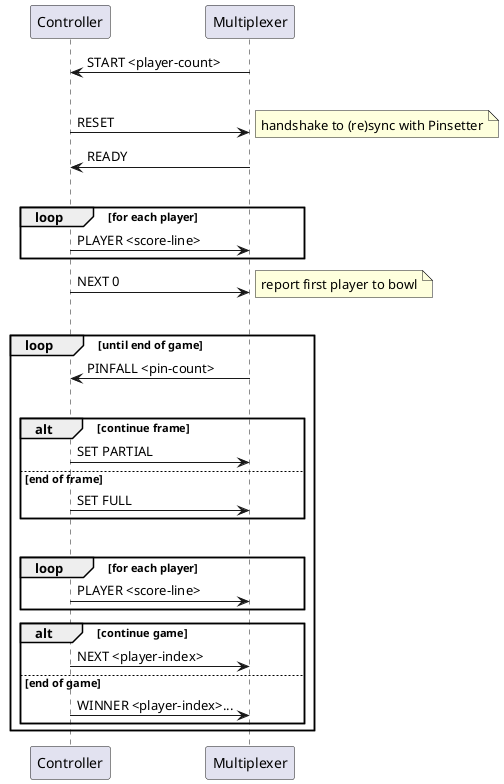

# Architecture

A set of software components run the games for a single bowling lane.

* The _Pinsetter_ controls the lane's pinsetter – a machine that automatically sets bowling pins back in their original positions, returns bowling balls to the front of the alley, and clears fallen pins from the pin deck.  The Pinsetter firmware communicates over serial cable with a text-based protocol.
* The _Console_ is a graphical user interface with which the players' enter their names, start the game, and see the current scoreboard and next player to bowl.
* The _Controller_ runs the game logic.  It keeps track of the players' turns and their scores.  It controls the _Pinsetter_ and updates the _Console_ as the game progresses.  It has a single input and output stream, and relies on the _Multiplexer_ to route messages to/from the other components.
* The _Multiplexer_ routes messages between the _Controller_, _Console_ and _Pinsetter_.

```plantuml
node Pinsetter {
    component Firmware
}

node LaneUnit {
    component Controller
    component Multiplexer
    component Console
}

Console -r- Multiplexer : pipe
Controller -d- Multiplexer : pipe
Multiplexer -r- Firmware : serial

actor  Bowler
Bowler -u- Console
```

In this workshop we are going to write the _Controller_.

## Testing the Controller locally during development

We simulate the Pinsetter in software on the developer machine and communicate with the fake pinsetter over Unix pipes.

```plantuml
node MacBook {
    component {
        component Console
        component Multiplexer
        component FakePinsetter
        
        Console - Multiplexer : pipe
        Multiplexer - FakePinsetter : pipe
    }
    
    component Controller
    Controller -- Multiplexer : pipe
}

actor You
You -u- Console
You -u- FakePinsetter
```


## Message flows

### Pinsetter protocol


```plantuml
participant Peer
participant Pinsetter


Peer -> Pinsetter : RESET
note right : Handshake to (re)sync state of peer & hardware
note over Peer : Peer ignores all messages \nuntil it receives READY 
Pinsetter -> Peer : READY

loop
    Pinsetter -> Peer : PINFALL <n>
    note right : Report pins knocked down by roll
    alt
        Pinsetter <- Peer : SET PARTIAL
        activate Pinsetter
        note right : Clear the lane of fallen pins\nSet pins that were standing for next roll
        deactivate Pinsetter
    else
        Pinsetter <- Peer : SET FULL 
        activate Pinsetter
        note right : Clear the lane of fallen pins\nSet all pins for next roll
        deactivate Pinsetter
    end
end
```

### ABNF Grammar

```
Inputs = 
    "RESET"
  | "SET space "PARTIAL"
  | "SET" space "FULL"

Outputs = 
    "READY"
  | "PINFALL" pin_count

pin_count = /[1-9][0-9]*/

space = " "
```

### Console protocol

```plantuml
participant Console
participant Peer

Console -> Peer : START <player-count>
note right : When the user has entered the player names\nand started a new game

loop until end of game
    |||
    note over Peer : Sends empty scores to acknowledge the START message\nand initialise the scoreboard display 
    
    loop for each player
        Peer -> Console : PLAYER <score-line>
        note right : Report per-frame scores and total score
    end
    |||
    alt game in progress
        Peer -> Console : NEXT <player-index>
        note right : Report the next player to bowl
    else end of game
        Peer -> Console : WINNER <player-index> ...
         note right : Report that the game is over and identify the winner(s)\nThere can be more than one in the case of a draw
    end
end
```

### ABNF Grammar

```
Inputs = 
    "PLAYER" space score_line
  | "NEXT" space player_index
  | "WINNER" space player_index_list

Outputs = "START" space player_count

score_line = frame_scores? score

frame_scores = frame_score | frame_score space frame_scores

frame_score = rolls "," score?

rolls = numeric_rolls | symbolic_spare | symbolic_strike

numeric_rolls = score? "," score?

symbolic_spare = score "," "/"

symbolic_strike = "X" "," | "," "X"

player_count = /[1-9][0-9]*/

player_index_list = player_index | player_index space player_index_list

player_index = /[0-9]+/

score = /[0-9]+/

space = " "
```

## Messages to/from the Controller

The Controller performs the Peer side of both the Pinsetter and Console protocols and relies on the Multiplexer to route messages to/from the other components.



