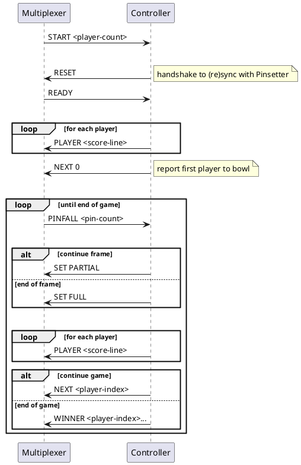

# Protocols

## Components

Deployment for testing the Controller locally

```plantuml
node MacBook {
    component {
        
        component Console
        component Multiplexer
        component FakePinsetter
        
        Console - Multiplexer : pipe
        Multiplexer - FakePinsetter : pipe
    }
    
    component Controller
    Controller -- Multiplexer : pipe
}

actor You
You -u- Console
You -u- FakePinsetter
```


Deployment in the field

```plantuml
node Pinsetter {
    component Firmware
}

node LaneUnit {
    component Controller
    component Multiplexer
    component Console
}

Console -r- Multiplexer : pipe
Controller -d- Multiplexer : pipe
Multiplexer -r- Firmware : serial

actor  Bowler
Bowler -u- Console
```

## Sequence diagram of message flows

### Pinsetter protocol

The Pinsetter controls the pinsetter hardware for the bowling lane.  The Pinsetter firmware communicates by a text-based protocol over serial cable.  For development, we simulate it in software and communicate with the simulation over Unix pipes.

```plantuml
participant Peer
participant Pinsetter


Peer -> Pinsetter : RESET
note right : Handshake to (re)sync state of peer & hardware
note over Peer : Peer ignores all messages \nuntil it receives READY 
Pinsetter -> Peer : READY

loop
    Pinsetter -> Peer : PINFALL <n>
    note right : Report pins knocked down by roll
    alt
        Pinsetter <- Peer : SET PARTIAL
        activate Pinsetter
        note right : Clear the lane of fallen pins\nSet pins that were standing for next roll
        deactivate Pinsetter
    else
        Pinsetter <- Peer : SET FULL 
        activate Pinsetter
        note right : Clear the lane of fallen pins\nSet all pins for next roll
        deactivate Pinsetter
    end
end
```

### Console protocol

The console is responsible for starting the game and displaying its progress.

```plantuml
participant Peer
participant Console

Console -> Peer : START <player-count>
note right : When the user has entered the player names\nand started a new game

loop until end of game
    |||
    note over Peer : Sends empty scores to acknowledge the START message\nand initialise the scoreboard display 
    
    loop for each player
        Peer -> Console : PLAYER <score-line>
        note right : Report per-frame scores and total score
    end
    |||
    alt game in progress
        Peer -> Console : NEXT <player-index>
        note right : Report the next player to bowl
    else end of game
        Peer -> Console : WINNER <player-index> ...
         note right : Report that the game is over and identify the winner(s)\nThere can be more than one in the case of a draw
    end
end

```

### Messages to/from the Controller

The controller performs the Peer side of the Pinsetter and Console protocols and relies on the Multiplexer to direct messages to/from the other components.




