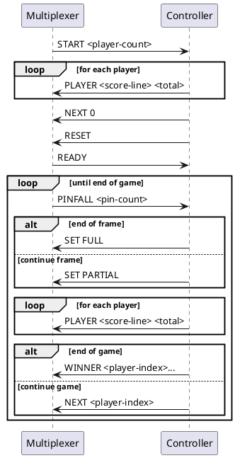
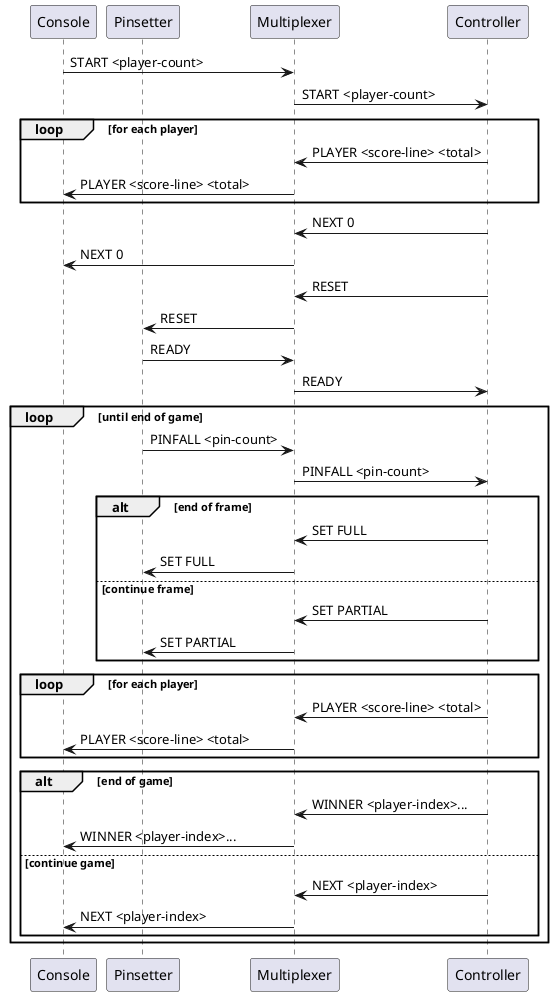

# Protocols

## Components

Deployment for testing the Controller locally

```plantuml
node MacBook {
    component {
        
        component Console
        component Multiplexer
        component FakePinsetter
        
        Console - Multiplexer : pipe
        Multiplexer - FakePinsetter : pipe
    }
    
    component Controller
    Controller -- Multiplexer : pipe
}

actor You
You -u- Console
You -u- FakePinsetter
```


Deployment in the field

```plantuml
node Pinsetter {
    component Firmware
}

node LaneUnit {
    component Controller
    component Multiplexer
    component Console
}

Console -r- Multiplexer : pipe
Controller -d- Multiplexer : pipe
Multiplexer -r- Firmware : serial

actor  Bowler
Bowler -u- Console
```

## Sequence diagram of message flows

Messages to/from the Controller



Message flow between all components: 




