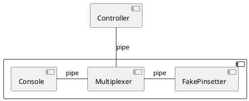
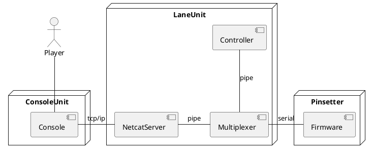

# Protocols

## Components

Deployment for testing the Controller locally

Deployment in the field

## Sequence diagram of message flows

Messages between the Controller and the Multiplexer

Message flow between all components: 

