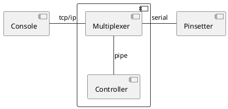
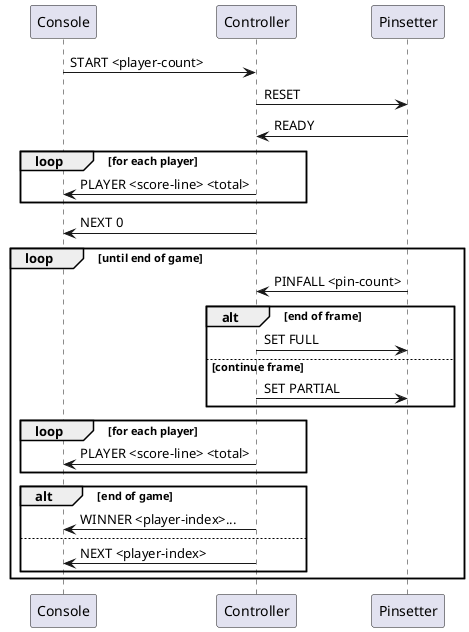

# Protocols

## Components

```plantuml
@startuml
component Console
component {
    component Multiplexer
    component Controller
    Multiplexer -- Controller : pipe
}
component Pinsetter

Console - Multiplexer : tcp/ip
Multiplexer - Pinsetter : serial

@enduml
```

## Sequence diagram of message flow

```plantuml
@startuml
Console -> Controller : START <player-count>
Controller -> Pinsetter : RESET
Controller <- Pinsetter : READY

loop for each player
    Console <- Controller : PLAYER <score-line> <total>
end
Console <- Controller : NEXT 0

loop until end of game
    Controller <- Pinsetter : PINFALL <pin-count>

    alt end of frame
        Controller -> Pinsetter : SET FULL
    else continue frame
        Controller -> Pinsetter : SET PARTIAL
    end

    loop for each player
        Console <- Controller : PLAYER <score-line> <total>
    end
    alt end of game
        Console <- Controller : WINNER <player-index>...
    else
        Console <- Controller : NEXT <player-index>
    end
end
@enduml
```
